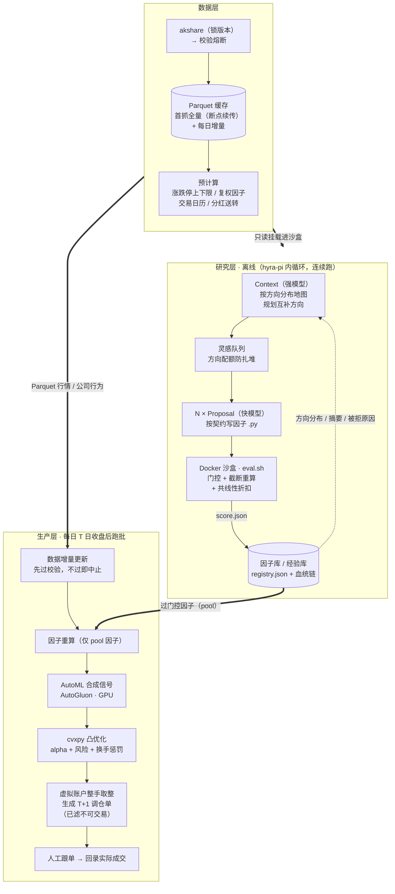

# ASTER · 星菀

**ASTER: Autonomous System for Trading, Evaluation & Research**
**星菀：自主量化研究与交易系统**

A 股日频量化系统：Agent 内循环挖因子 + AutoML 合成信号 + 凸优化组合，每日产出目标持仓与可执行调仓单，人工跟单。

fork 自 [hyra-pi](https://github.com/001eander/hyra-pi)，单仓库双语言：TypeScript 编排层（内循环、调度）+ Python 执行层（数据、因子、回测、组合、跑批）。研究层与生产层解耦，因子库是两者之间的唯一接口。

> 个人量化项目，仅供研究与自用，不构成投资建议。

## 实现的功能

当前 M0–M3 与 M1.5 已验收（tag `m1.5` / `m2` / `m3`），M4（AutoML 增强）进行中。

### 数据层

- akshare → Parquet 本地缓存：全市场日线、交易日历、证券信息（含退市股）、分红送转、基准指数日行情；首次全量抓取支持断点续传，每日增量一条命令跑完
- 涨跌停上下限预计算：主板 10%、创业板 20%（2020-08-24 起）、科创板 20%、北交所 30%、ST 5%，按板块 / 时段 / ST 规则表判定
- 东财行业分类落地；沪深 300 / 中证 500 / 中证 1000 成分与权重 PIT 解析（官方月度权重锚 + 本地按日收益漂移，历史由 CSMAR 离线回填）
- 跑批前强制数据校验（完整性、异常值、复权口径一致性），不过即中止

### 因子与模型

- 因子接口：每个因子一个 `.py` 文件实现 `compute(data)`，polars 向量化，禁 IO、禁随机、禁 cutoff 后数据
- 因子级评估管线：schema 校验 → 截断重算检测（行为级防前视）→ 复杂度卡控 → RankIC / ICIR / 分层单调性 / 换手 → 共线性折扣与入库查重，产出 `score.json`
- AutoGluon（GPU）合成截面信号，训练配置随模型落盘，回测与跑批按同一配置复现
- 因子库注册表（`registry.json`）记录经济假设、评估指标、方向标签与血统链，支持定期整库（同簇留强 + 容量上限）

### 组合与回测

- cvxpy 凸优化：alpha + 收缩协方差风险项 + 换手惩罚，目标权重整手取整可行化
- 指数增强优化器：基准锚定约束族（个股带 / 行业 / 流通市值 / 风格）+ 放松阶梯 + 失败漂移，zz1000 池 + 000852 基准端到端验证通过
- 账户级回测覆盖 A 股全规则：T+1、涨跌停拒单、整手（主板 100 股 / 科创板 200 起）、停牌估值、佣金（双边 + 最低 5 元）、印花税（卖出千 0.5）、滑点、分红送转除权
- 基准绩效（超额年化 / 跟踪误差 / 信息比率）与持仓风险分析四表（指数 / 市值 / 风格 / 主动行业暴露）

### 生产跑批

- `run_daily.py` 每日一体化跑批：因子重算 → 模型打分 → 凸优化 → 整手取整 → 调仓单（CSV + Parquet）+ 跑批报告 + 虚拟账户持久化
- 两种策略形态由一份 JSON 配置切换：全市场选股 / 指数增强；调仓频率支持日 / 周 / 月
- 调仓单已按整手对齐并附参考价与预估金额，T 日停牌与涨跌停提前过滤，人工照单执行即可

### Agent 因子挖掘内循环

- Context（强模型）读取因子库方向分布地图，规划互补的挖掘方向；灵感队列按方向配额限流，防止并行 Proposal 扎堆同一信号源
- Proposal（快模型）按接口契约写因子，Docker 沙盒（断网、数据只读挂载）内 `eval.sh` 评分，硬失败与分数统一由 `score.json` 表达
- 经验库记录每次尝试的成败与被拒原因，血统链（seed / mutation / crossover）支撑轨迹级多代进化，入库质量单调性与库内相关性受控均有多代验证

## 技术方案



关键口径与设计：

- **无前视纪律**：信号 cutoff = T 日收盘，成交 = T+1 开盘价 + 滑点，标签 = T+1 开盘 → T+2 开盘收益。标签只在 `quant/labels/` 定义，IC / RankIC / ICIR / 分层只在 `quant/eval/metrics.py` 实现，三层回测共享同一套内核
- **三层回测**：因子级（秒级，内循环高频调用）→ 模型级（walk-forward 样本外拼接）→ 账户级（完整费用与规则）
- **账户模拟器一套两用**：历史回测由批量数据驱动，生产模式持久化为虚拟账户每日产出调仓单，回测与实盘的滑点偏差因此可量化
- **奖励信号一致**：入库门控全部体现在 `score.json`（`score = quality × (1 − max_corr)`），Agent 学到的评分函数与入库规则没有出入
- **共线性四层防御**：Context 方向分布地图源头分流 → Proposal 附同方向因子摘要要求机制差异 → 评分按与库内因子最大相关性折扣 → 入库行为查重（|corr| > 0.7 拒入）与定期整库
- **面向协议编程**：数据源、因子、模型、策略配置均可替换，akshare 接口变动只需改 `quant/data/source/akshare.py`

## 创新之处

1. **Agent 驱动因子挖掘**：hyra-pi 内循环落地 A 股场景——Context 按方向配额规划互补挖掘方向，Proposal 在沙盒中写因子并由真实回测指标评分，经验库与血统链支撑轨迹级进化，共线性由四层防御贯穿全程
2. **AutoML / AutoResearch**：AutoGluon（GPU）合成信号并滚动重训；远期由 Agent 接管调参与网络结构演化（M5）
3. **A 股原生**：指数增强（基准锚定约束族）与全市场选股两种策略形态；T+1、分板块涨跌停、整手、停牌、佣金印花税滑点全规则覆盖
4. **账户级仿真回测**：账户模拟器同时服务历史回测与每日跟单虚拟账户，调仓单天生可执行
5. **多阶段验证**：因子级 → 模型级（walk-forward）→ 账户级三层回测，open-to-open 统一标签口径
6. **可自定义**：策略配置、股票池、prompt、评分函数全部开放，鼓励魔改

## 实际应用价值

- **每日可执行产出**：T 日收盘后跑一次跑批，拿到整手对齐、附参考价与预估金额的调仓单，停牌与涨跌停已预过滤，人工照单跟单即可，盘前无需再加工
- **回测与实盘同炉**：虚拟账户与回测共用同一套账户与撮合逻辑，回测里看到的换手、费用、拒单就是跟单时会遇到的，滑点偏差可量化追踪
- **指增直接对标实盘产品语言**：基准锚定约束族与指数 / 市值 / 风格 / 主动行业四张暴露表，对应私募指增的风控口径，zz1000 + 000852 已端到端验证
- **因子库持续增值**：Agent 内循环可连续运转数天，入库因子带指标与血统记录，成为可复用、可审计的研究资产
- **全链路本地化**：数据落 Parquet、模型本地训练、跑批无外部服务依赖，一台带显卡的机器即可完整运行

## 快速开始

环境要求：Python ≥ 3.12 + [uv](https://docs.astral.sh/uv/)，Node ≥ 20；因子挖掘内循环另需 Docker。有 NVIDIA 显卡时 AutoGluon 自动走 CUDA（torch 已锁 cu128 源）。

```bash
# 1. 安装依赖
uv sync                          # Python 执行层
npm install && npm run build     # TS 编排层

# 2. 数据初始化：首次全量抓取（默认 2015-01-01 至今，断点续传）
ASTER_NO_PROXY=1 uv run python scripts/fetch_data.py
uv run python scripts/validate_data.py

# 3. 训练基线模型（AutoGluon，GPU）
uv run python scripts/train_baseline.py --start 2021-09-29 --end 2024-12-31 \
    --model-dir runs/automl/baseline --time-limit 1800 --presets medium_quality

# 4. 端到端回测（产出净值曲线、报告、持仓与风险四表）
uv run python scripts/backtest_e2e.py --model-dir runs/automl/baseline \
    --start 2025-01-02 --end 2026-09-28 --benchmark 000905 --risk-report \
    --out-dir runs/e2e

# 5. 每日跑批（T 日收盘后：先更新数据，再出调仓单）
ASTER_NO_PROXY=1 uv run python scripts/daily_update.py
uv run python scripts/run_daily.py
```

每日跑批产物：`runs/orders/YYYY-MM-DD.{parquet,csv}`（调仓单）、`runs/reports/YYYY-MM-DD.json`（跑批报告）、`runs/account/<name>.json`（虚拟账户，起始现金默认 100 万，可用 `--initial-cash` 改）。

指数增强策略用一份 JSON 配置切换（`run_daily.py --strategy-config` 与 `backtest_e2e.py` 同一口径）：

```json
{
  "strategy": "index_enhanced",
  "universe": "zz1000",
  "benchmark": "000852",
  "top_k": 50,
  "rebalance_freq": "M"
}
```

### 因子挖掘内循环

```powershell
docker build -f docker/factor-eval.Dockerfile -t aster-factor-eval .
$env:HYRA_PI_IMAGE = "aster-factor-eval"
$env:HYRA_PI_EXTRA_MOUNTS = "$PWD/data:/data:ro"   # 数据只读挂载，多条用分号分隔
node dist/cli.js run --task tasks/factor-mining --proposals 3 --budget 30m
```

因子契约与过关线见 `tasks/factor-mining/TASK.md`：RankIC ≥ 0.02、ICIR ≥ 0.2、分层单调性为正、与库内因子相关性 ≤ 0.7，截断重算与复杂度卡控全过才入库。

### 测试

```bash
uv run pytest    # Python 单测（默认跳过 slow 真实训练；-m slow 单跑）
npm test         # TS 单测（vitest）
```

### 代理说明

`requests` 会读 Windows 注册表里的系统代理配置。本机系统代理可能损坏，抓取类脚本设 `ASTER_NO_PROXY=1` 时会在导入网络库之前把 `NO_PROXY` 置为 `*`，绕过系统代理直连。

## 目录结构

```
ASTER/
├── src/                  # [TS] 编排层：内循环、经验库、灵感队列、沙盒调度、CLI
├── prompts/              # context.md / proposal.md：因子挖掘 prompt
├── quant/                # [Python] 执行层
│   ├── data/             #   DataSource 协议、akshare、Parquet 缓存、校验、涨跌停、指数/行业
│   ├── labels/           #   open-to-open 标签（全局唯一口径）
│   ├── factor_api/       #   因子接口规范、schema 校验、截断重算、复杂度度量
│   ├── eval/             #   指标内核（IC/RankIC/ICIR/分层）、因子级评估
│   ├── factor_lib/       #   因子库注册表、血统链、相关性查重、定期整库
│   ├── backtest/         #   账户、撮合、费用、主循环、公司行为
│   ├── portfolio/        #   cvxpy 优化器、指增约束族、整手取整、风险四表
│   ├── automl/           #   AutoGluon 数据集与训练
│   ├── universe/         #   股票池 PIT 解析
│   └── daily/            #   每日跑批、策略配置、虚拟账户
├── tasks/factor-mining/  # Agent 任务包：TASK.md + eval.sh（沙盒评分入口）
├── docker/               # 沙盒镜像（Python + 依赖，数据只读挂载）
├── factor_library/       # 因子代码 + registry.json（入 git）
├── scripts/              # 抓取 / 更新 / 训练 / 回测 / 跑批 CLI
├── tests/                # pytest
├── data/                 # 本地数据（不入 git）
└── runs/                 # 运行记录（不入 git）
```

## 文档

- `AGENTS.md`：仓库约定与量化纪律
- `factor_library/README.md`：因子接口约定、注册表 schema、整库规则与因子清单
- `docker/README.md`：沙盒镜像构建与手动冒烟
- `tasks/factor-mining/TASK.md`：Agent 因子挖掘任务契约（输入输出、禁令、评分与过关线）

## 风险与已知限制

- akshare 退市股历史覆盖不全，第一版接受幸存者偏差并在文档明示
- akshare 接口可能变动：锁版本 + 校验熔断 + 数据源抽象层隔离，坏了只改一处
- 本仓库所有回测结果不构成投资建议，跟单盈亏自负

## License

[GPLv2](LICENSE)（GNU General Public License v2.0）。
